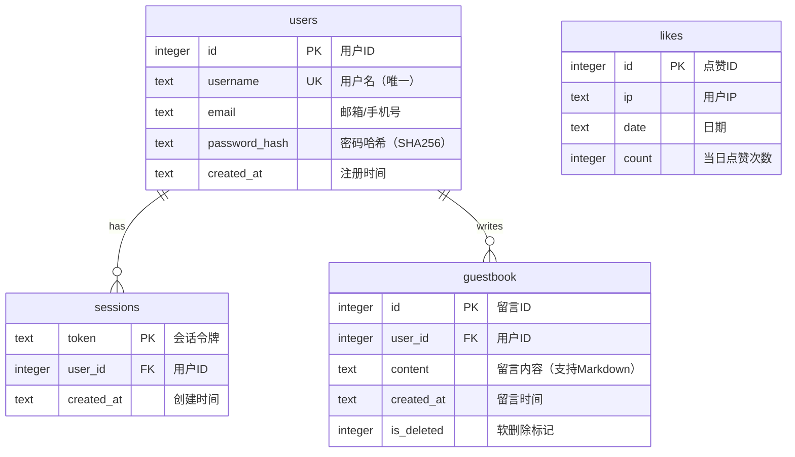

# 太原理工大学机器人团队 · 2026 纳新网站

TYUT Robot Team 2026 Recruitment Website — 基于 FastAPI 的服务端渲染网站，赛博朋克风格的招新宣传与信息展示平台。

## 技术栈

- **后端**: FastAPI + Jinja2 + Uvicorn
- **前端**: 原生 HTML/CSS/JS（无框架依赖）
- **3D 渲染**: Three.js（首页粒子 + 线框几何体背景）
- **数据库**: SQLite（点赞 + 用户认证 + 留言板）
- **字体**: 系统回退字体（Orbitron + Rajdhani + Noto Sans SC）

## 项目结构

```
.
├── main.py                 # FastAPI 入口，页面路由 + API + 数据库初始化
├── requirements.txt        # Python 依赖
├── likes.db                # SQLite 数据库（likes / users / sessions / guestbook）
├── templates/              # Jinja2 模板
│   ├── index.html          # 首页（机器人动画、点赞按钮、3D背景）
│   ├── organization.html   # 组织概况（三大战队、指导老师、团队风采）
│   ├── training.html       # 培养方案（时间线 + Tab切换详细计划）
│   ├── research.html       # 竞赛科研（算力、平台、成果）
│   └── guestbook.html      # 留言板（Markdown支持）
├── static/
│   ├── css/style.css       # 全局样式 + 赛博朋克主题 + 点赞/登录/留言板样式
│   └── js/
│       ├── main.js         # 主题切换、滚动动画、点赞、用户认证、留言板、页面转场
│       └── three-bg.js     # Three.js 3D 粒子背景
└── images/
    ├── 照片/               # 二维码、透明Logo、抖音等
    ├── 导师/               # 指导老师头像
    └── 合照/               # 团队活动照片（8张）
```

## 页面

| 路由 | 页面 | 说明 |
|------|------|------|
| `/` | 首页 | CSS机器人动画、3D背景、三条成长路线、成就数据、点赞 |
| `/organization` | 组织概况 | 三大战队、指导老师简介、8张团队风采照片 |
| `/training` | 培养方案 | 四年时间线概览 + 三队 Tab 切换详细培养路线 |
| `/research` | 竞赛科研 | 算力资源、平台支持、竞赛成果、科研成果、社区伙伴 |
| `/guestbook` | 留言板 | 登录后可发表 Markdown 留言，支持删除自己的留言 |

## 快速开始

```bash
# 1. 安装依赖
pip install -r requirements.txt

# 2. 启动服务
python main.py

# 3. 浏览器访问
# http://localhost:8000
```

服务默认运行在 `http://0.0.0.0:8000`，开发模式下启用热重载。

## API

| 方法 | 路由 | 说明 |
|------|------|------|
| GET | `/api/likes` | 获取总点赞数 |
| POST | `/api/like` | 点赞（同一IP每日上限5次） |
| POST | `/api/register` | 用户注册（username, email, password） |
| POST | `/api/login` | 用户登录，返回 session cookie |
| POST | `/api/logout` | 用户登出 |
| GET | `/api/me` | 获取当前登录用户信息 |
| GET | `/api/guestbook` | 获取所有留言 |
| POST | `/api/guestbook` | 发表留言（需登录，支持 Markdown） |
| DELETE | `/api/guestbook/{id}` | 删除自己的留言（需登录） |

## 功能特性

- 赛博朋克视觉风格：霓虹光效、扫描线叠加、噪点纹理、电路板背景
- 暗色/亮色双主题切换（localStorage 持久化）
- 响应式布局，移动端适配
- CSS 机器人动画（首页 Hero 区域，浮动 + 发光效果）
- 页面转场特效（导航链接扫描线过渡）
- 点赞系统（IP 限制每日 5 次，SQLite 持久化，粒子特效）
- 首页 Three.js 3D 交互背景（鼠标视差、几何体旋转、浮动粒子）
- 页面滚动入场动画（Intersection Observer）
- 固定导航栏 + 毛玻璃模糊效果 + 滚动阴影
- 组织概况页：指导老师卡片（研究方向 / 科研成果 / 论文列表）
- 培养方案页：Tab 切换三队培养路线，详细月度计划表
- 竞赛科研页：算力资源卡片、平台支持网格、竞赛成果表格
- 用户注册/登录系统（密码 SHA256 哈希、HTTPOnly Cookie Session）
- 留言板：Markdown 渲染、权限校验（仅本人可删除）
- 透明 Logo（PNG，导航栏统一使用）

## 数据库 E-R 图


